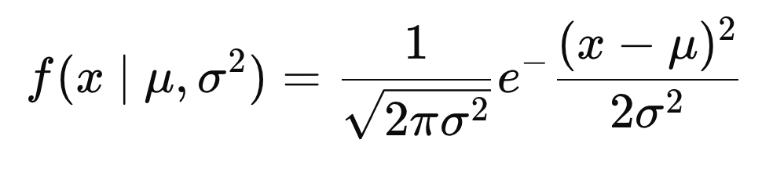

# Course Notes

## Gaussian Distribution Formulas
### probability density function

$`f(x ∣ μ,σ^2)=\frac{1}{\sqrt{2πσ^2}}e-
\frac{(x−μ)2​}{2σ^2}`$

where:
    μ​ is the mean  
    σ is the standard deviation
    $σ^2$ is the variance​

## Binomial Distribution Formulas
### mean
    μ = n ∗ p
a fair coin has a probability of a positive outcome (heads) p = 0.5. If you flip a coin 20 times, the mean would be 20 * 0.5 = 10; you'd expect to get 10 heads.
### variance
$`σ^2=n∗p∗(1−p)`$`

 n would be the number of coin tosses and p would be the probability of getting heads

 ### standard deviation
$`σ=\sqrt{n∗p∗(1−p)}`$

 the standard deviation is the square root of the variance.

 ### probability density function
 $`f(k,n,p)=\frac{!n}{k!(n−k)!} ​p^k (1−p)^(n−k)'$