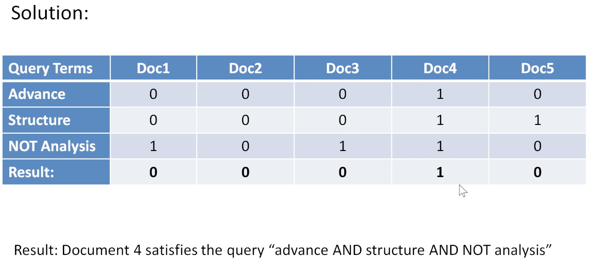

# Build a Search Engine with Python

#Setup
pip install nltk

```bash
python3 lemmatization_and_tokenization.py
```

resolves ERROR: Can not perform a '--user' install. User site-packages are not visible in this virtualenv.

Source: [Stackoverflow](https://stackoverflow.com/questions/64278198/error-can-not-perform-a-user-install-user-site-packages-are-not-visible-in)
1. Go to the `pyvenv.cfg` file in the Virtual environment folder
2. Set the  `include-system-site-packages` to `true` and save the change
3. Reactivate the virtual environment.

## Install nltk
pip install --user -U nltk

Resolves: 
[nltk_data] Error loading punkt: <urlopen error [SSL:
[nltk_data]     CERTIFICATE_VERIFY_FAILED] certificate verify failed:
[nltk_data]     unable to get local issuer certificate (_ssl.c:997)>
False

Source: [StackOverflow](https://stackoverflow.com/questions/38916452/nltk-download-ssl-certificate-verify-failed)
```bash
cd /Applications/Python\ 3.10/
./Install\ Certificates.command 
```
rerun script
python3 lemmatization_and_tokenization.py 

pop up downloader window appears click the Download button and the Cancel will appear while the downloads are in progress:

When downloads are complete, closing the window will resume application execution.


## Information Retrieval
Finding infromation(text documents) from large collections (unstructured data). 
Applications
* Web search engineds
* Information Filtering -> Recommender Systems
* Image/Music retrieval - categorize, identify or create


## Text Preprocessing

### Tokenization
Break sentencens into words called tokens.
NLTK, Natural Language ToolKit in Python

### Case folding
Converting text to a consistent case, upper or lower.

### Stop words removal
Remove high frequency words that do not carry much meaning or value in a text "the", "and", "a", etc.
#### Zipf's Law
The frequency of a word in a corpus is inversly proportional to its rank.

frequence(word)= 1/rank(word)

### Lemmatization
Reducing word to thier baae/dictionary form, known as lemma
Construction = Construct
bats => bat
feet => foot

###  Stemming
Chop off the ends of words to their base form (Works well for English language).

Example:
Automate, automatic, automation reduce to automat.

* Porter Stemming algorithm (Port Stemmer)

## Inverted Index
Data structure that maps content to it's location in documents

* Inverse of forward index which maps documents to it's content

Purpose - allow fast full text search at a cost of increased processing when adding the document to the database

Goal of search engine - optimize the speed of the query by finding the document where the query word(s) occur

### Posting List
For each term in a document, a list is maintained in which docments the term occurs

Each item in the list called a **posting**

## Positional Inverted Index
Frequency and position of words/tokens included in an inverted index, then it is called a positional index or positional inverted index.

## Retrieval Models
Models for retrieving similar documents from a collection of documents. ie. searching for documents on the web is an example.  There are many.

### Boolean Retrieval Model
* Simplest method relying on Boolean operators
* Terms in a query are linked together with AND, OR, and NOT.
* Term weights are set to 1 if the terms occur in a document.

    

    

    


#### Limitations 
* Very rigid -> AND means all & OR means any.
* All matched documents logically satisfy query, making it difficult to control number of documents retrieved or to rank them.
* Incapable of ranking th ouput documents.


### Vector Space Retrieval Model (VSM)
* An algebraic model for representing text documents as vectors in a multidimensional space.
* Each document is represented as a vector of terms, where the dimensions corrspond to the terms (words or phrases) in the entire collection of documents.

##### Creating a VSM
* Normailaze text by removing stop words.
* Create a vocabulary by selecting the most frequent terms in the entire document colletnion.
*  Each document is represented as a vetor of term frequencies or weights.
* Vectors can be compared using similarity measures suc as the cosine similarity.

##### Vector Space Model

>Documents and queries are represented as vectors.

> $d_{j}=(w_{1,j},w_{2,j},...,w_{n,j})$
>
> $q=(w_{1,q},w_{2,q},...,w_{n,q})$
>
> In document $d_{j}$ all terms inside the document can be represented as coordinate points in a multidimensional vector space.
>
>Similarly query q, containing terms $(w_{1,q}...w_{n,q})$ it can be represented on its own in the equation if represent the query in the vector space.

* Each dimension corresponds to a seperate term.
* If a term occurs in the document, it's value in the vecor is non-zero

##### Example Vector Space Model


##### Advantages Vector Space Model (over Boolean Model)
* Simple model based on linear algebra
* Term weights are not binary
* Allows computing a continuous degee of similarity between queries and documents
* Allows ranking documents according to possible relevance
* Allows partial matching

#### Cosine Similarity
>A measure of similarity between two non-zero vectors defined in a vector space.
* 


Reference: [Mathmatic Formulas in Markdown](https://csrgxtu.github.io/2015/03/20/Writing-Mathematic-Fomulars-in-Markdown/)